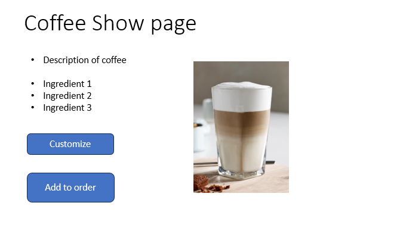

# Donut Shop MERN-Stack Application

## Overview

This MERN-Stack Donut Shop application offers users a delightful experience of browsing through a variety of mouthwatering donuts. Upon selection of a donut, users can pair it with their favorite coffee from a diverse array of options. Additionally, users have the flexibility to customize their coffee or even create a new blend to suit their taste preferences. A user will also be able to see a random recommendation for the donut the picked

## User Stories

As a user I want the ability to:

* Sign-up as a customer 
* See a list of available donuts 
* See a page of details of each donut such as description and price
* Choose a donut and assign a coffee to my donut
* Customize my coffee's ingredients if I wish i.e. choose honey over cane sugar
* Create a coffee according to my preferences
* See a coffee recomendation for the donut that I choose
* Be able to add my coffee and donut to a order and see the total price
* Be able to delete items from my order if I change my mind

## Wireframes

## Entity Relationship Diagrams (ERD)

